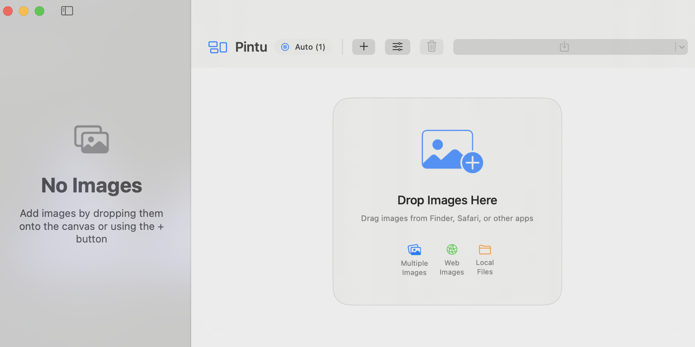

# Pintu

A simple and elegant collage maker for macOS.



## Why I Created This App

I wanted a simple way to create photo collages from web images with drag and drop. That's it.

No complex features, no bloated interface - just drag your images and create beautiful collages instantly.

## Features

- **Drag & Drop**: Simply drag images from anywhere to create collages
- **Auto Layout**: Smart column arrangement based on your images
- **Manual Control**: Adjust columns, spacing, and styling as needed
- **Reorder Images**: Drag images within the collage to rearrange them
- **Export Options**: Save as PNG or JPEG in multiple quality settings
- **Modern Design**: Clean, native macOS interface

## How to Use

1. **Add Images**: Drag images from web browsers, Finder, or any app
2. **Arrange**: Drag images within the grid to reorder them
3. **Customize**: Open settings to adjust columns, spacing, colors, and corner radius
4. **Export**: Click the export button to save your collage

## Requirements

- macOS 15.5 or later
- Xcode 16+ (for building from source)

## Installation

### From Source
```bash
git clone https://github.com/0xyub/pintu.git
cd pintu
open pintu.xcodeproj
```

Then build and run from Xcode.

## Donation
f you find this project helpful, please consider making a donation.
Your donation will help me maintain and create more open-source projects.
https://nowpayments.io/donation/0xyub

## License

MIT License - feel free to use and modify as you like.

---

*Simple tools for simple needs.*
